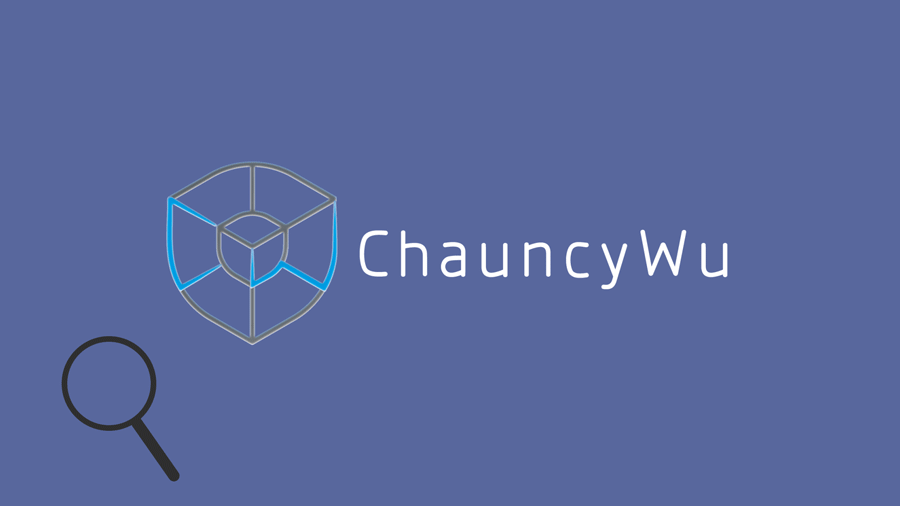

# 前端学习路径

前言：虽然学习前端快2年了，但也只能说是刚刚入门，这里整理下初学走过的坑，也当做记录下自己的学习经历，以便初学者少走些弯路，可能有些地方说得不对，毕竟自己也是初学，欢迎大家纠错，互相学习。

## 学习路径：
* 基础：html css js jq [慕课网前端学习路径](http://www.imooc.com/course/programdetail/pid/32)

* 各个基础深入：(至少学完第2列，在慕课网均能找到相关教程，多百度)

<table>
    <tr>
        <th></th>
        <th>1</th>
        <th>2</th>
        <th>3</th>
        <th>4</th>
    </tr>
    <tr>
        <td>超文本标记语言</td>
        <td>html</td>
        <td>html5</td>
        <td>……</td>
        <td>……</td>
    </tr>
    <tr>
        <td>层叠样式表</td>
        <td>css</td>
        <td>css3</td>
        <td>Less/Sass</td>
        <td>……</td>
    </tr>
    <tr>
        <td>脚本语言</td>
        <td>js</td>
        <td>jq</td>
        <td>ES6</td>
        <td>……</td>
    </tr>
</table>

* 以下需要时再学习，都是基于最基础的html，css，js，教程在以下推荐的网站中均有涉及：
    * 嫌弃界面太丑？想快速写出能看的界面？用 Bootstrap 
    * 需要绘制表格？ Echars
    * 登录注册等表单验证？ Vaildate

* 先写到这……正在学习框架中……后期继续更新……

## 视频网站（App）：

### 1.[慕课网](http://class.imooc.com/)

### 2.[极客学院](http://www.jikexueyuan.com/)

### 3.[网易云课堂](http://study.163.com/)

## 知乎：

[知乎上有哪些在前端开发领域的高质量回答？](https://www.zhihu.com/question/20246142/answer/14470387)

[Web 建站技术中，HTML、HTML5、XHTML、CSS、SQL、JavaScript、PHP、ASP.NET、Web Services 是什么？](https://www.zhihu.com/question/22689579/answer/22318058
)

[怎么学习前端开发？求推荐学习路线？](https://www.zhihu.com/question/30180100/answer/156399333
)

有问题的可以留言，没有经常登，不一定看得见，看见如果会的一定回答，前端小白一只，有错误的欢迎指正，有什么建议的也可以留言，想要投稿的留言投稿主题，可以互相交流，共同进步。

